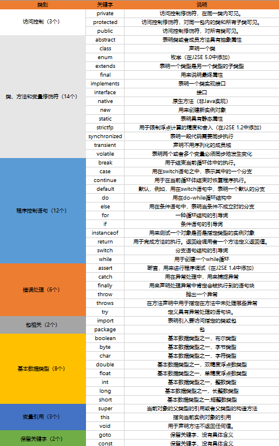
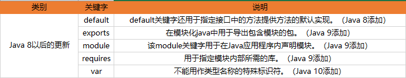
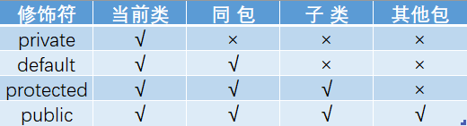
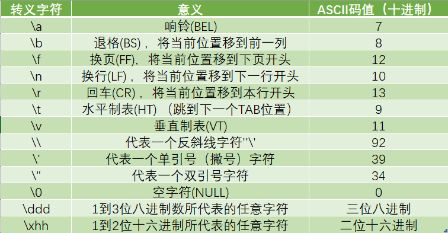
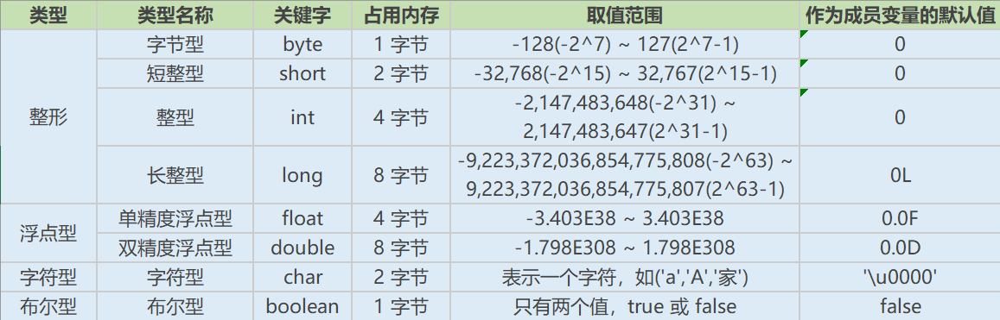
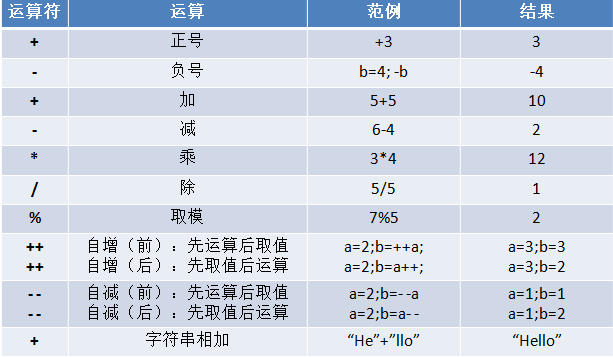
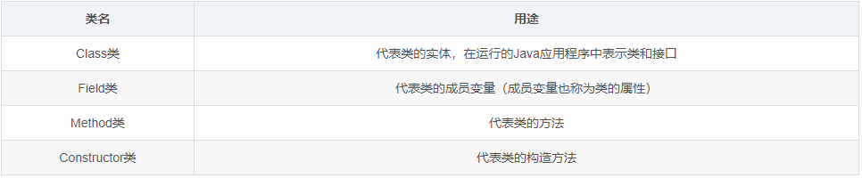

# java
## java标识符命名规范  
* 包名：全部小写，多级包用.隔开。
举例：com.jourwon
* 类、接口：一个单词首字母大写，多个单词每个单词的首字母大写。
举例：Student,Car,HelloWorld
* 方法和变量：一个单词首字母小写，多个单词从第二个单词开始每个单词的首字母大写。
举例：age,maxAge,show(),getAge()
* 常量：如果是一个单词,所有字母大写，如果是多个单词,所有的单词大写,用下划线区分每个单词。
举例：DATE,MAX_AGE
* 项目名：全部用小写字母，多个单词之间用横杆-分割。
举例：demo，spring-boot

## 关键字
 

## 访问修饰符  
使用访问修饰符来保护对类、变量、方法和构造方法的访问  
* private : 在同一类内可见。使用对象：变量、方法。 注意：不能修饰类（外部类）  
* default (即缺省，什么也不写，不使用任何关键字）: 在同一包内可见，不使用任何修饰符。使用对象：类、接口、变量、方法。  
* protected : 对同一包内的类和所有子类可见。使用对象：变量、方法。 注意：不能修饰类（外部类）。   
* public : 对所有类可见。使用对象：类、接口、变量、方法  
    
## 分隔符  
* ; 分号 用来终止一个语句
* {} 花括号、大括号 用来包括自动初始化的数组的值，也用来定义程序块、类、方法以及局部范围
* [] 方括号、中括号 用来声明数组的类型，也用来表示撤消对数组值的引用
*  , 逗号 在变量声明中，区分变量说明的各个变量。在for控制语句中，用来将圆括号内的语句连接起来
*  . 原点 用来将软件包的名字与它的子包或类分隔。也用来将引用变量与变量或方法分隔
*  () 圆括号 在定义和调用方法时用来容纳参数表。在控制语句或强制类型转换组成的表达式中用来表示执行或计算的优先权  
## 转义字符


## 基本数据类型
  

1. ***隐式转换***: 
在运算过程中，由于不同的数据类型会转换成同一种数据类型，所以整型、浮点型以及字符型都可以参与混合运算。自动转换的规则是从低级类型数据转换成高级类型数据。  
* 转换规则:  1. 数值型数据的转换：byte→short→int→long→float→double。   2.数值型数据的转换：byte→short→int→long→float→double。
2. ***显式转换***:   
   当两种数据类型不兼容，或目标类型的取值范围小于源类型时，自动转换将无法进行，这时就需要进行强制类型转换
   * ***语法格式***:
       目标类型 变量名 = (目标类型) (被转换的数据);  
       举例：int b = (byte)(a + b);

## 运算符  
  

## java变量

```
public class Variable{
    // 类变量
    static int allClicks=0;    
     // 实例变量
    String str="hello world";  
    public void method(){
		 	// 局部变量
        int i =0;  
    }
}
```   

## java常量    
**定义** 在程序执行的过程中，其值不可以发生改变的量  
* Java 语言使用 final 关键字来定义一个常量： 
   ```final int COUNT=10;   final float HEIGHT=10.2F;```

## 反射
**定义：** Java反射机制是在运行状态中，对于任意一个类，都能够知道这个类的所有属性和方法；对于任意一个对象，都能够调用它的任意方法和属性。这种动态获取信息以及动态调用对象方法的功能称为Java语言的反射机制。
当我们在使用 IDE（如 IDEA/Eclipse）时，当我们输入一个对象或者类并调用它的属性和方法时，一按 (“.”)点号，编译器就会自动列出她的属性或方法，这里就会用到反射
**反射最重要的用途就是开发各种通用框架**  
### 反射机制的相关类 ###  
  

## 数组
### 一维数组的声明与初始化
1. 静态初始化
   ```
   int [] id;
   id = new int {1,2,3,4,5}
2. 动态初始化
```
String [] stringarray = new String[10];
int [] intarray = {1,2,3,4,5};
```
3.  一维数组元素的默认初始化值
   数组元素是整型：0
   数组元素是浮点型：0.0
   数组元素是char型：0或‘、u0000',而非’0‘
   数组元素是boolean型：false
   数组元素是引用类型：null
### 二维数组
1. 声明与初始化
   **静态初始化**
   int [] [] arr1 = new int [][]{{1,2,3},{1,2,3}};
   **动态初始化**
   ```
   String [][] arr2 = new String[3][2];
   String [][] arr3 = new String[3][];
   arr3[1] = new String[4];
   ```

## 语法糖（Syntactic Sugar） ##  
**定义：** 指在计算机语言中添加的某种语法，这种语法对语言的功能并没有影响； 简而言之，语法糖让程序更加简洁，有更高的可读性。  
**存在：** Java中的语法糖只存在于编译期，在编译器将 .java 源文件编译成 .class 字节码时   
* 糖块一、switch支持String与枚举  
 ```
 public class SwitchDemoString {
    public static void main(String[] args) {
        String str = "world";
        switch (str) {
        case "hello":
            System.out.println("hello");
            break;
        case "world":
            System.out.println("world");
            break;
        default:
            break;
        }
    }
}
```  
* 糖块二、泛型和类型擦除  

# 未完，待续  
## 注解
  又名元数据，即一种描述数据的数据。例如我们常见的@Override和@Deprecated  
  * 用途  
   1. 生成文档，通过代码里标识的元数据生成javadoc文档。  
   2. 编译检查，通过代码里标识的元数据让编译器在编译期间进行检查验证。  
   3. 编译时动态处理，编译时通过代码里标识的元数据动态处理，例如动态生成代码。  
   4. 运行时动态处理，运行时通过代码里标识的元数据动态处理，例如使用反射注入实例  
 * 分类  
  1. Java自带的标准注解；@Override（标明重写某个方法）、@Deprecated（标明某个类或方法过时）和@SuppressWarnings（标明要忽略的警告），使用这些注解后编译器就会进行检查  
  2. 元注解，用于定义注解的注解，包括@Retention（标明注解被保留的阶段）、@Target（标明注解使用的范围）、@Inherited（标明注解可继承）、@Documented（标明是否生成javadoc文档）  

## JSON  
  **简介：** JSON(JavaScript Object Notation JavaScript 对象表示法)是一种轻量级的数据交换格式，它基于JavaScript的一个子集，易于人的编写和阅读，也易于机器解析。  
  **结构组成：** 由两种结构组成  
  1. 键值对的无序集合——对象(或者叫记录、结构、字典、哈希表、有键列表或关联数组等)  
  2. 值的有序列表——数组    
    
**语法规则：**  
* 数据在名称/值对中  
* 数据由逗号分隔  
* 大括号保存对象  
* 中括号保存数组  

**JSON的形式：**   
* 对象  
  一个无序键值对的集合，以"{“开始，同时以”}“结束，键值对之间以”:“相隔，不同的键值对之间以”,"相隔  
  ```
  {
    "key1" : 1,
    "key2" : "string"
  }  
   ```   
* 数组  
  值（value）的有序集合。一个数组以“[”（左中括号）开始，“]”（右中括号）结束。值之间使用“,”（逗号）分隔。  
  ``` 
  [ "Google", "Runoob", "Taobao" ]   
  ```  

## Properties类  
**简介:** Properties 继承于 Hashtable。表示一个持久的属性集，属性列表以key-value的形式存在，key和value都是字符串。  Java中有个比较重要的类Properties（Java.util.Properties），主要用于读取Java的配置文件，  
**常用方法实践**  
1. *写入*   
 Properties类调用setProperty方法将键值对保存到内存中，此时可以通过getProperty方法读取，propertyNames方法进行遍历，但是并没有将键值对持久化到属性文件中，故需要调用store方法持久化键值对到属性文件中。  
 ``` 
 public static void main(String[] args) throws IOException {
    Properties properties = new Properties();
    OutputStream output = null;
    try {
        output = new FileOutputStream("src/main/resources/config.properties");
        properties.setProperty("username", "root");
        properties.setProperty("password", "123456");

        // 保存键值对到文件中
        properties.store(output, "JourWon modify");

    } catch (IOException io) {
        io.printStackTrace();
    } finally {
        if (output != null) {
            try {
                output.close();
            } catch (IOException e) {
                e.printStackTrace();
            }
        }
    }
}
```  
2. *读取*  
```
public static void main(String[] args) throws IOException {
    // PropertiesTest.getPath1();
    // PropertiesTest.getPath2();
    // PropertiesTest.getPath3();
    // PropertiesTest.getPath4();
    // PropertiesTest.getPath5();
    PropertiesTest.getPath6();
}

/**
     * 一、 使用java.util.Properties类的load(InputStream in)方法加载properties文件
     * 主要是需要加上src这个文件夹名。路径配置需要精确到绝对地址级别
     *
     * @return
     */
public static void getPath1() throws IOException {
    InputStream in = new BufferedInputStream(new FileInputStream(
        new File("src/main/resources/prop.properties")));

    printKeyValue(in);

}

/**
     * 二、 使用java.util.ResourceBundle类的getBundle()方法
     * 注意：这个getBundle()方法的参数只能写成包路径+properties文件名，注意不需要带上后缀名。
     *
     * @return
     */
public static void getPath2() {
    ResourceBundle rb = ResourceBundle
        .getBundle("prop");

    printKeyValueRb(rb);
}

/**
     * 三、 使用java.util.PropertyResourceBundle类的构造函数
     *
     * @return
     */
public static void getPath3() throws IOException {
    InputStream in = new BufferedInputStream(new FileInputStream("src/main/resources/prop.properties"));
    ResourceBundle rb = new PropertyResourceBundle(in);

    printKeyValueRb(rb);
}

/**
     * 四、 使用class变量的getResourceAsStream()方法
     * 注意：getResourceAsStream()方法的参数按格式写到包路径+properties文件名+.后缀
     *
     * @return
     */
public static void getPath4() throws IOException {
    InputStream in = PropertiesTest.class
        .getResourceAsStream("/prop.properties");

    printKeyValue(in);
}

/**
     * 五、
     * 使用class.getClassLoader()所得到的java.lang.ClassLoader的
     * getResourceAsStream()方法
     * getResourceAsStream(name)方法的参数必须是包路径+文件名+.后缀
     * 否则会报空指针异常
     *
     * @return
     */
public static void getPath5() throws IOException {
    InputStream in = PropertiesTest.class.getClassLoader()
        .getResourceAsStream("./././prop.properties");

    printKeyValue(in);
}

/**
     * 六、 使用java.lang.ClassLoader类的getSystemResourceAsStream()静态方法
     * getSystemResourceAsStream()方法的参数格式也是有固定要求的
     *
     * @return
     */
public static void getPath6() throws IOException {
    InputStream in = ClassLoader
        .getSystemResourceAsStream("./././prop.properties");

    printKeyValue(in);
}


/**
     * 单独抽取的方法，用户检测能否正确操纵Properties
     *
     * @param inputStream
     * @throws IOException
     */
public static void printKeyValue(InputStream inputStream) throws IOException {
    Properties properties = new Properties();
    properties.load(inputStream);
    Set<Object> keys = properties.keySet();
    for (Object key : keys) {
        System.out.println(key + " = " + properties.get(key));
    }

    if (inputStream != null) {
        inputStream.close();
    }
}

public static void printKeyValueRb(ResourceBundle rb) {
    Set<String> keys = rb.keySet();
    for (String key : keys) {
        System.out.println(key + " = " + rb.getString(key));

    }
}
```  
3. *遍历*  
```
   // 输出properties的key和value
public static void printProp(Properties properties) {
    System.out.println("---------（方式一）------------");
    for (String key : properties.stringPropertyNames()) {
        System.out.println(key + "=" + properties.getProperty(key));
    }

    System.out.println("---------（方式二）------------");
    //返回属性key的集合
    Set<Object> keys = properties.keySet();
    for (Object key : keys) {
        System.out.println(key.toString() + "=" + properties.get(key));
    }

    System.out.println("---------（方式三）------------");
    Set<Map.Entry<Object, Object>> entrySet = properties.entrySet();
    //返回的属性键值对实体
    for (Map.Entry<Object, Object> entry : entrySet) {
        System.out.println(entry.getKey() + "=" + entry.getValue());
    }

    System.out.println("---------（方式四）------------");
    Enumeration<?> e = properties.propertyNames();
    while (e.hasMoreElements()) {
        String key = (String) e.nextElement();
        String value = properties.getProperty(key);
        System.out.println(key + "=" + value);
    }
}
```

## XML  
  **简介：** 可扩展标记语言（EXtensible Markup Language）。  
  **用途：** 应用于 Web 开发的许多方面，常用于简化数据的存储和传输。  
  **存放数据栗子:**  
  ```
  <?xml version="1.0" encoding="UTF-8"?>
<persons>
    <person id="p001">
        <name>张三</name>
    </person>
    <person id="p002">
        <name>李四</name>
    </person>
</persons>  
  ```  
  **配置文件栗子:**
  ```  
  <?xml version="1.0" encoding="UTF-8"?>
<web-app version="2.5">
    <servlet>
        <servlet-name>HelloMyServlet</servlet-name>
        <servlet-class>com.jourwon.HelloMyServlet</servlet-class>
    </servlet>
    <servlet-mapping>
        <servlet-name>HelloMyServlet</servlet-name>
        <url-pattern>/hello</url-pattern>
    </servlet-mapping>
</web-app>
  ```  

**语法**  
XML文件主要由XML文档声明，元素，属性，注释，转义字符，CDATA区，处理指令组成。  
1. XML文档声明  
   ``` <?xml version="1.0" encoding="UTF-8"?>  ```  
   文档声明只有三个属性： 
   * versioin：指定XML文档版本。必须属性，因为我们不会选择1.1，只会选择1.0;   
   * encoding：指定当前文档的编码。可选属性，默认值是utf-8；  
   * standalone：指定文档独立性。可选属性，默认值为yes，表示当前文档是独立文档。如果为no表示当前文档不是独立的文档，会依赖外部文件。  
2. ***元素***  
   普通元素的结构开始标签、元素体、结束标签组成。  
   元素体：元素体可以是元素，也可以是文本，  
   空元素：空元素只有开始标签，而没有结束标签，但元素必须自己闭合，   
3. ***属性 ***  
   * 属性的定义格式：属性名=属性值，其中属性值必须使用单引或双引 
   * 属性是元素的一部分，它必须出现在元素的开始标签中 
   * 一个元素可以有0~N个属性，但一个元素中不能出现同名属性
4. ***转义字符***  
   在元素体或属性值中想使用这些符号就必须使用转义字符  
5. ***处理指令***  
   解析引擎如何解析 XML 文档内容  
   比如：在 XML 文档中可以使用 xml-stylesheet 指令，通知 XML 解析引擎，应用 CSS 文件显示 XML 文档内容  
   ``` <?xml-stylesheet type="text/css" href="a.css"?>```  
   处理指令必须以<? 开头，以 > 结尾  
6. ***XML的解析***  
 开发中比较常见的解析方式有三种  
 * DOM：要求解析器把整个XML文档装载到内存，并解析成一个Document对象。  
    a) 优点：元素与元素之间保留结构关系，故可以进行增删改查操作。   
    b) 缺点：XML文档过大，可能出现内存溢出显现。
 * SAX：是一种速度更快，更有效的方法。它逐行扫描文档，一边扫描一边解析。并以事件驱动的方式进行具体解析，每执行一行，都将触发对应的事件。（了解）  
  a) 优点：处理速度快，可以处理大文件  
  b) 缺点：只能读，逐行后将释放资源。  
  * PULL：Android内置的XML解析方式，类似SAX。  
  
## YML 
 ***简介 :*** (YAML Aint Markup Language)是一种标记语言，通常以.yml或者.yaml为后缀的文件，是一种直观的能够被电脑识别的数据序列化格式，  一种专门用来写配置文件的语言。
***语法***
 1. 约定 
  * k: v 表示键值对关系，冒号后面必须有一个空格  
  * 使用空格的缩进表示层级关系，空格数目不重要，只要是左对齐的一列数据，都是同一个层级的  
  * 大小写敏感      
  * 缩进时不允许使用Tab键，只允许使用空格。  
  2. 键值关系  

## Java8新特性-Lambda表达式  

***Lambda表达式（也称闭包）***
Lambda表达式允许函数作为一个方法的参数（函数作为参数传递到方法中），或者把代码看成数据。Lambda表达式可以简化函数式接口的使用。函数式接口就是一个只具有一个抽象方法的普通接口，像这样的接口就可以使用Lambda表达式来简化代码的编写。


## javaBean   
**可重用组件**  类是公共的， 有一个无参构造器， 有对应的get，set方法
```pulic class bean{
    private int id;
    private int String name;

    public bean(){

    }

    public void setId(int i){
        id = i;
    }

    public int getId(){
        return id;
    }

    public String getName(){
        return name;
    }
}
```

## 继承  
关键字：extend
java中所有类的父类Object,定义的所有类的都是继承Object;
关键字：super  理解：父类的....；用来调用属性，方法；（有些用法和this相似；）

 